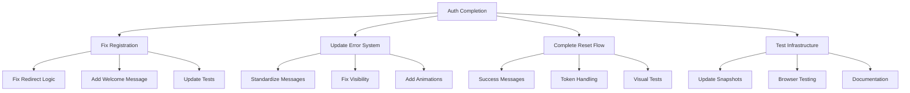

# Authentication System Completion Plan

## Current Status Summary

The authentication system has several key components working but faces specific issues:

1. Registration Form
   - Not redirecting to dashboard
   - Missing welcome message
   - Visual regression test failures

2. Error Message Display
   - LoginForm messages not matching test expectations
   - Invalid email format validation not visible
   - Error message visibility issues in tests

3. Password Reset Flow
   - Success message display issues
   - Invalid token error message problems
   - Visual regression test failures

## Implementation Plan



## Phase 1: Registration Flow (1 day)

### 1.1 Fix Redirect Logic
```typescript
// navigation.ts
export const handleAuthRedirect = async (session: Session | null) => {
  if (session?.user) {
    await router.push('/dashboard');
    return true;
  }
  return false;
};
```

### 1.2 Welcome Message Implementation
```typescript
// components/auth/RegistrationSuccess.tsx
export const RegistrationSuccess = () => {
  return (
    <div role="alert" className="success-message">
      Welcome! Your account has been created.
    </div>
  );
};
```

### 1.3 Test Updates
- Update registration test assertions
- Add welcome message checks
- Verify redirect behavior

## Phase 2: Error Message System (1 day)

### 2.1 Standardize Error Messages
```typescript
// error-constants.ts
export const AUTH_ERRORS = {
  INVALID_EMAIL: 'Please enter a valid email address',
  INVALID_PASSWORD: 'Password must be at least 8 characters',
  CHECK_EMAIL: 'Please check your email for reset instructions',
  INVALID_TOKEN: 'Invalid or expired reset token'
};
```

### 2.2 Error Component Updates
```typescript
// components/ui/ErrorMessage.tsx
export const ErrorMessage = ({ 
  message,
  visible,
  testId 
}: ErrorMessageProps) => {
  if (!visible) return null;
  return (
    <div 
      role="alert"
      data-testid={testId}
      className="error-message animate-fade-in"
    >
      {message}
    </div>
  );
};
```

### 2.3 Form Integration
- Update LoginForm error handling
- Implement validation feedback
- Add error animations

## Phase 3: Password Reset Flow (1 day)

### 3.1 Success Message Implementation
```typescript
// components/auth/ResetPasswordForm.tsx
const handleResetRequest = async () => {
  try {
    await resetPassword(email);
    setMessage(AUTH_ERRORS.CHECK_EMAIL);
    setVisible(true);
  } catch (error) {
    handleResetError(error);
  }
};
```

### 3.2 Token Validation
- Improve token validation logic
- Add proper error handling
- Update success/error messages

### 3.3 Visual Tests
- Update visual regression tests
- Add new test cases
- Verify message visibility

## Phase 4: Test Infrastructure (1 day)

### 4.1 Update Test Environment
- Configure proper test isolation
- Update test utilities
- Add browser-specific checks

### 4.2 Visual Regression
- Update snapshots for new UI
- Add test coverage for animations
- Document visual testing approach

### 4.3 Documentation
- Update test documentation
- Add setup instructions
- Document common issues

## Success Criteria

### Functional Requirements
- [ ] Registration redirects to dashboard
- [ ] Welcome message displays correctly
- [ ] Error messages visible and accurate
- [ ] Password reset flow complete
- [ ] Session handling working

### Test Requirements
- [ ] All auth tests passing
- [ ] Visual regression tests updated
- [ ] Browser compatibility verified
- [ ] Test documentation complete

## Implementation Timeline

1. Day 1: Registration Flow
   - Morning: Fix redirect logic
   - Afternoon: Welcome message and tests

2. Day 2: Error System
   - Morning: Standardize messages
   - Afternoon: Component updates

3. Day 3: Reset Flow
   - Morning: Success messages
   - Afternoon: Token handling

4. Day 4: Testing
   - Morning: Update test environment
   - Afternoon: Documentation

## Next Steps

1. Begin with registration redirect fix:
```typescript
// Immediate action in navigation.ts
export const setupAuthRedirects = () => {
  // Implement redirect logic
};
```

2. Switch to Code mode for implementation
3. Follow phase-by-phase implementation
4. Regular test verification

## Dependencies

- NextAuth.js configuration
- TRPC client setup
- Session provider
- Error message components

## Risk Mitigation

1. Session Management
   - Add proper error handling
   - Implement session recovery
   - Add validation checks

2. Test Stability
   - Use proper wait conditions
   - Add retry mechanisms
   - Improve error reporting

3. Browser Compatibility
   - Test across browsers
   - Add fallback behaviors
   - Document limitations