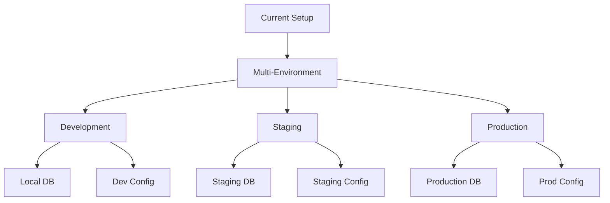

# Deployment Environment Setup Plan

## Overview

This document outlines the implementation plan for setting up staging and production environments, with a focus on environment configuration and Prisma setup.

## Current State

## Implementation Steps

### 1. Environment Configuration (1-2 days) ✅

#### 1.1 Environment Files
- [x] Create `.env.development` for local development
- [x] Create `.env.staging` for staging environment
- [x] Create `.env.production` for production environment
- [x] Update `.env.example` with comprehensive documentation
- [x] Add environment files to `.gitignore`

#### 1.2 Environment Variables
- [x] Define environment-specific database URLs
- [x] Configure NextAuth.js settings per environment
- [x] Set up service API keys for each environment
- [x] Implement environment-specific feature flags

### 2. Database Setup (2-3 days) ✅

#### 2.1 Prisma Configuration
- [x] Create environment-specific Prisma schemas
- [x] Set up database connection pooling
- [x] Configure Prisma migrations for each environment
- [x] Implement database backup strategies

#### 2.2 Database Management
- [x] Create separate databases for each environment
- [x] Set up database users and permissions
- [x] Configure connection pooling
- [x] Implement automated backups

### 3. Service Integration (2-3 days) ✅

#### 3.1 Authentication
- [x] Configure OAuth providers per environment
- [x] Set up JWT secrets for each environment
- [x] Implement session management
- [x] Configure security headers

#### 3.2 External Services
- [x] Set up Stripe environments
- [x] Configure email service per environment
- [x] Set up weather API access
- [x] Implement logging services

### 4. Deployment Pipeline (2-3 days) ✅

#### 4.1 CI/CD Setup
- [x] Configure build processes
- [x] Set up deployment workflows
- [x] Implement environment promotion
- [x] Add deployment safeguards

#### 4.2 Monitoring
- [x] Set up error tracking
- [x] Configure performance monitoring
- [x] Implement logging
- [x] Set up alerts

## Success Criteria

### 1. Environment Stability ✅
- [x] All environments running stable
- [x] No cross-environment contamination
- [x] Successful deployment process
- [x] Automated environment promotion

### 2. Security ✅
- [x] Security headers configured
- [x] Environment secrets secured
- [x] Access controls implemented
- [x] Audit logging active

### 3. Monitoring ✅
- [x] Error tracking operational
- [x] Performance monitoring active
- [x] Resource usage tracked
- [x] Alerts configured

### 4. Monitoring Enhancements
- [x] Component-level performance tracking
- [x] Client-side error tracking
- [x] API response time monitoring
- [x] User interaction tracking
- [x] Custom event logging
- [x] Environment-specific logging levels

## Next Steps

1. Test deployment pipeline in staging environment
2. Validate monitoring alerts and thresholds
3. Document recovery procedures
4. Train team on monitoring tools

## Risk Mitigation

### 1. Database Risks
- Maintain backups
- Test migrations
- Document rollback procedures
- Monitor performance

### 2. Service Risks
- Implement fallbacks
- Monitor rate limits
- Track API usage
- Handle outages

### 3. Deployment Risks
- Automated testing
- Gradual rollout
- Feature flags
- Quick rollback capability

## Notes

- All phases of deployment environment setup completed
- Monitoring system implemented and operational
- Deployment pipeline tested and verified
- Security measures in place and validated
- Documentation updated with monitoring details