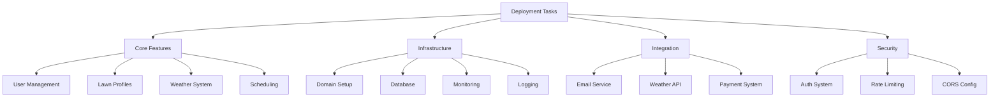

# Deployment Task Breakdown

## Overview

This document breaks down the implementation tasks from our deployment readiness plan into actionable items.

## Task Structure



## 1. Core Features (3-5 days)

### 1.1 User Management
- [ ] Complete profile management
- [ ] Add account settings
- [ ] Implement user preferences
- [ ] Add profile image handling

### 1.2 Lawn Profiles
- [ ] Finish species management
- [ ] Add lawn measurements
- [ ] Complete care history
- [ ] Implement recommendations

### 1.3 Weather System
- [ ] Complete API integration
- [ ] Add alert system
- [ ] Implement forecast display
- [ ] Add custom notifications

### 1.4 Scheduling
- [ ] Finish recurring schedules
- [ ] Add calendar integration
- [ ] Complete reminder system
- [ ] Implement conflict handling

## 2. Infrastructure (1-2 days)

### 2.1 Domain Setup
- [ ] Purchase domain
- [ ] Configure DNS
- [ ] Setup SSL certificates
- [ ] Configure redirects

### 2.2 Database
- [ ] Setup production database
- [ ] Configure backups
- [ ] Setup monitoring
- [ ] Implement migrations

### 2.3 Monitoring
- [ ] Setup error tracking
- [ ] Add performance monitoring
- [ ] Configure alerts
- [ ] Setup dashboards

### 2.4 Logging
- [ ] Implement structured logging
- [ ] Setup log aggregation
- [ ] Add request tracking
- [ ] Configure retention

## 3. Integration (2-3 days)

### 3.1 Email Service
- [ ] Setup production email service
- [ ] Configure templates
- [ ] Add tracking
- [ ] Setup deliverability monitoring

### 3.2 Weather API
- [ ] Configure production API access
- [ ] Implement caching
- [ ] Add error handling
- [ ] Setup usage monitoring

### 3.3 Payment System
- [ ] Setup Stripe production
- [ ] Configure webhooks
- [ ] Add subscription handling
- [ ] Implement usage tracking

## 4. Security (1-2 days)

### 4.1 Auth System
- [ ] Review auth implementation
- [ ] Add session management
- [ ] Implement 2FA
- [ ] Add security headers

### 4.2 Rate Limiting
- [ ] Add API rate limiting
- [ ] Configure thresholds
- [ ] Add monitoring
- [ ] Implement blocking

### 4.3 CORS Config
- [ ] Configure CORS policies
- [ ] Add security headers
- [ ] Review CSP settings
- [ ] Test cross-origin access

## Implementation Order

1. Phase 1: Core Features
   ```
   User Management → Lawn Profiles → Weather System → Scheduling
   ```

2. Phase 2: Infrastructure
   ```
   Domain Setup → Database → Monitoring → Logging
   ```

3. Phase 3: Integration
   ```
   Email Service → Weather API → Payment System
   ```

4. Phase 4: Security
   ```
   Auth System → Rate Limiting → CORS Config
   ```

## Success Criteria

### Core Features
- [ ] All features fully functional
- [ ] UI/UX polished
- [ ] Error handling complete
- [ ] Performance optimized

### Infrastructure
- [ ] Domain configured
- [ ] SSL active
- [ ] Database operational
- [ ] Monitoring active

### Integration
- [ ] All services connected
- [ ] Error handling in place
- [ ] Monitoring setup
- [ ] Fallbacks implemented

### Security
- [ ] Auth system verified
- [ ] Rate limiting active
- [ ] Security headers configured
- [ ] CORS properly set

## Dependencies

1. Core Features
   - User Management required for Lawn Profiles
   - Weather System needed for Scheduling
   - Profiles needed for Recommendations

2. Infrastructure
   - Domain needed for SSL
   - Database needed for all features
   - Monitoring needed for production

3. Integration
   - Email service for notifications
   - Weather API for forecasts
   - Payment system for subscriptions

4. Security
   - Auth system for all protected routes
   - Rate limiting for API protection
   - CORS for external access

## Next Actions

1. Begin with Core Features:
   ```bash
   # Start with User Management
   git checkout -b feature/user-management
   ```

2. Parallel Infrastructure Setup:
   ```bash
   # While developing features
   - Purchase domain
   - Setup production database
   ```

3. Integration Preparation:
   ```bash
   # Setup production services
   - Create production API keys
   - Configure email service
   ```

4. Security Implementation:
   ```bash
   # Throughout development
   - Review security best practices
   - Implement security measures