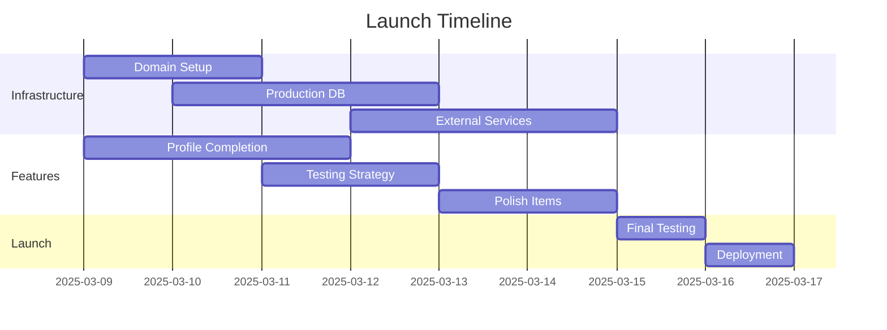

# Launch Readiness Audit
March 8, 2025

## Executive Summary

The Lawn Genius application has made significant progress with core features implemented, but requires specific actions before production deployment. This audit outlines completed work, current status, and remaining tasks for launch.

## Completed Work

### Core Systems
1. Authentication
   - Email/password authentication
   - Session management
   - Password reset functionality
   - Auth middleware
   - Protected routes

2. User Management
   - Registration system
   - Profile management
   - Privacy settings
   - TRPC routes for user operations

3. Technical Infrastructure
   - Next.js setup
   - TRPC integration
   - Prisma database setup
   - Form validation with Zod
   - UI component library

## Current Status

### Working Features
- Basic authentication flows
- User registration and login
- Profile management basics
- Dashboard navigation
- Protected route handling

### Known Issues
1. Testing
   - E2E auth tests failing
   - Visual regression tests need updates
   - Form validation message display issues
   - Reset token validation problems

2. Features
   - Image upload incomplete
   - Profile preview pending
   - Loading states needed
   - Validation feedback improvements required

## Launch Requirements

### 1. Critical Path Items (1-2 weeks)
- [ ] Domain Setup
  - Purchase domain
  - Configure DNS
  - Setup SSL certificates

- [ ] Production Infrastructure
  - Setup production database
  - Configure backups
  - Implement migrations
  - Setup monitoring
  - Configure logging

- [ ] External Service Integration
  - Email service configuration
  - Weather API integration
  - Payment system setup

- [ ] Security Measures
  - Rate limiting implementation
  - CORS configuration
  - Final security review

### 2. Feature Completion (3-5 days)
- [ ] Profile Management
  - Complete image upload
  - Add profile preview
  - Implement loading states
  - Enhance validation feedback

- [ ] Testing Strategy
  - Document manual testing procedures
  - Add critical unit tests
  - Disable problematic E2E tests
  - Create deployment checklist

### 3. Polish Items (2-3 days)
- [ ] UI refinements
- [ ] Error handling improvements
- [ ] Success messages
- [ ] Loading indicators
- [ ] Navigation flow optimization

## Timeline

## Recommendations

### 1. Immediate Actions
1. Begin domain acquisition process
2. Setup production database environment
3. Complete profile management features
4. Document manual testing procedures

### 2. Technical Priorities
1. Disable problematic E2E tests temporarily
2. Focus on critical unit tests
3. Complete external service integrations
4. Implement security measures

### 3. Process Improvements
1. Create deployment checklist
2. Document manual testing procedures
3. Setup monitoring and alerting
4. Prepare rollback procedures

## Risk Assessment

### High Risk
- E2E test stability
- Production database setup
- External service integration

### Medium Risk
- Image upload functionality
- Profile management completion
- Loading state implementation

### Low Risk
- UI refinements
- Documentation updates
- Polish items

## Success Criteria

1. Technical Requirements
   - Application deployed to production domain
   - SSL properly configured
   - Database migrations successful
   - External services integrated

2. Functional Requirements
   - User authentication working
   - Profile management complete
   - Core features functional
   - Critical bugs resolved

3. Non-Functional Requirements
   - Acceptable load times
   - Proper error handling
   - Security measures in place
   - Monitoring configured

## Post-Launch Plan

### Week 1
- Monitor system performance
- Address critical bugs
- Collect user feedback
- Optimize based on metrics

### Week 2
- Re-enable and fix E2E tests
- Implement user feedback
- Optimize database queries
- Enhance monitoring

### Week 3
- Add advanced features
- Improve test coverage
- Optimize user experience
- Plan next feature set