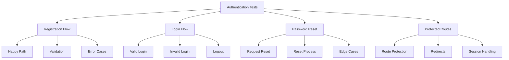

# Manual Testing Guide

## Authentication System Testing

This guide provides step-by-step instructions for manually testing the authentication system while automated e2e tests are disabled.

### Prerequisites

- Test account credentials:
  ```
  Email: test@example.com
  Password: password123
  ```
- Clean browser session (use incognito/private window)
- Local development server running

### Test Scenarios



### 1. Registration Flow

#### Happy Path
1. Navigate to /auth/register
2. Enter valid information:
   - Name: Test User
   - Email: [unique]@example.com
   - Password: StrongPass123!
3. Submit form
4. Expected:
   - Success message appears
   - Redirected to dashboard
   - Welcome email received

#### Validation Testing
1. Try submitting empty form
2. Enter invalid email formats
3. Enter weak passwords
4. Expected:
   - Clear error messages
   - Form maintains state
   - No submission on invalid data

#### Error Cases
1. Try registering existing email
2. Test network error scenarios
3. Expected:
   - Appropriate error messages
   - Data not persisted
   - User can retry

### 2. Login Flow

#### Valid Credentials
1. Navigate to /auth/login
2. Enter test account credentials
3. Submit form
4. Expected:
   - Successful login
   - Redirect to dashboard
   - User menu visible
   - Session persisted

#### Invalid Credentials
1. Try incorrect email
2. Try incorrect password
3. Try invalid formats
4. Expected:
   - Clear error messages
   - No session created
   - Remain on login page

#### Logout Process
1. Login successfully
2. Open user menu
3. Click logout
4. Expected:
   - Session terminated
   - Redirect to home
   - Login link visible

### 3. Password Reset

#### Request Reset
1. Navigate to forgot password
2. Enter valid email
3. Submit request
4. Expected:
   - Success message
   - Reset email sent
   - Clear next steps

#### Reset Process
1. Click reset link in email
2. Enter new password
3. Submit form
4. Expected:
   - Password updated
   - Able to login with new password
   - Old password invalid

#### Edge Cases
1. Try expired reset link
2. Try already used reset link
3. Try invalid reset token
4. Expected:
   - Clear error messages
   - Security not compromised
   - User guided to retry

### 4. Protected Routes

#### Route Protection
1. Logout completely
2. Try accessing:
   - /dashboard
   - /profile
   - /settings
3. Expected:
   - Redirect to login
   - Return URL preserved
   - Session check working

#### Session Handling
1. Login successfully
2. Close and reopen browser
3. Visit protected route
4. Expected:
   - Session restored
   - Access granted
   - No unnecessary redirects

### Test Results Documentation

For each test scenario, document:

```markdown
## Test Case: [Name]
Date: [YYYY-MM-DD]
Tester: [Name]

### Steps Performed
1. 
2. 
3. 

### Expected Results
- 
- 
- 

### Actual Results
- 
- 
- 

### Issues Found
- [ ] None
- [ ] Issue 1: [Description]
- [ ] Issue 2: [Description]

### Screenshots
[Attach relevant screenshots]

### Notes
[Any additional observations]
```

### Critical Paths to Test Daily

1. Registration of new user
2. Login with existing account
3. Password reset flow
4. Protected route access
5. Session persistence
6. Logout functionality

### Reporting Issues

When an issue is found:

1. Document the exact steps to reproduce
2. Capture relevant screenshots
3. Note any error messages
4. Record environment details:
   - Browser version
   - Device type
   - Time of occurrence
   - User account used

### Success Criteria

✅ All critical paths working
✅ No security vulnerabilities
✅ Clear error messages
✅ Proper session handling
✅ Responsive on all devices

### Test Environment Setup

1. Local Development
   ```bash
   npm run dev
   ```

2. Staging Environment
   ```bash
   npm run start:staging
   ```

3. Production Testing
   ```bash
   npm run start:prod
   ```

### Contact Points

- Technical Issues: [Dev Team Contact]
- Security Concerns: [Security Team Contact]
- Urgent Problems: [Emergency Contact]