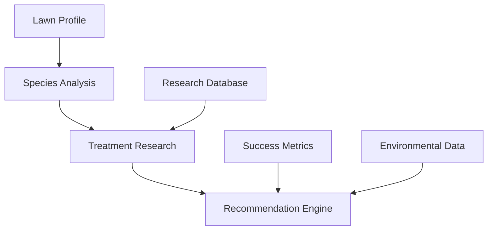

# Grass Species Management and Evidence-Based Treatment System

## Overview
Design for a comprehensive system that manages grass species data, their characteristics, and provides evidence-based treatment recommendations based on species composition and environmental factors.

## Data Models

### Grass Species
```prisma
model GrassSpecies {
  id                String   @id @default(cuid())
  name              String   // e.g., "Kentucky Bluegrass"
  scientificName    String   // e.g., "Poa pratensis"
  type              String   // cool-season, warm-season
  characteristics   Json     // growth patterns, appearance, etc.
  idealConditions   Json     // soil, climate, sun exposure
  maintenance       Json     // mowing height, water needs, etc.
  commonMixes       String[] // species it commonly mixes well with
  createdAt         DateTime @default(now())
  updatedAt         DateTime @updatedAt

  // Relations
  lawnProfiles      LawnGrassComposition[]
  treatments        SpeciesTreatment[]
}

model LawnGrassComposition {
  id            String   @id @default(cuid())
  lawnProfileId String
  speciesId     String
  percentage    Int      // composition percentage
  createdAt     DateTime @default(now())
  updatedAt     DateTime @updatedAt

  lawnProfile   LawnProfile   @relation(fields: [lawnProfileId], references: [id])
  species       GrassSpecies  @relation(fields: [speciesId], references: [id])
}

model SpeciesTreatment {
  id            String   @id @default(cuid())
  speciesId     String
  treatmentId   String
  effectiveness Int      // 1-5 rating
  notes         String?
  evidence      Json     // research citations, success rates
  conditions    Json     // specific conditions for effectiveness
  createdAt     DateTime @default(now())
  updatedAt     DateTime @updatedAt

  species       GrassSpecies    @relation(fields: [speciesId], references: [id])
  treatment     TreatmentType   @relation(fields: [treatmentId], references: [id])
}
```

## Evidence-Based Treatment System



### Research Integration
1. Academic Sources
   - University research papers
   - Agricultural extension services
   - Field studies
   - Success rate data

2. Treatment Effectiveness
   - Species-specific results
   - Climate zone data
   - Soil type correlation
   - Seasonal effectiveness

3. Best Practices
   - Species-specific care
   - Mixed lawn management
   - Regional adaptations
   - Seasonal considerations

## Treatment Recommendation Algorithm

```typescript
interface LawnComposition {
  species: Array<{
    id: string;
    percentage: number;
    characteristics: SpeciesCharacteristics;
  }>;
}

interface TreatmentRecommendation {
  treatment: Treatment;
  confidence: number;
  evidence: ResearchEvidence[];
  speciesSpecificNotes: Map<string, string>;
  expectedResults: ExpectedResults;
}

function generateRecommendations(
  composition: LawnComposition,
  goals: UserGoals,
  conditions: EnvironmentalConditions
): TreatmentRecommendation[] {
  // 1. Analyze species composition
  // 2. Match species needs with goals
  // 3. Consider environmental factors
  // 4. Find supported treatments
  // 5. Rank by evidence strength
  // 6. Generate specific instructions
}
```

## Species-Specific Considerations

### Mixed Lawn Management
```typescript
interface MixedLawnStrategy {
  dominantSpecies: GrassSpecies;
  companions: GrassSpecies[];
  balancingTechniques: Technique[];
  maintenanceAdjustments: Adjustment[];
}

function optimizeMixedLawn(
  composition: LawnComposition,
  goals: UserGoals
): MixedLawnStrategy {
  // 1. Identify dominant species
  // 2. Analyze species interactions
  // 3. Determine optimal balance
  // 4. Create maintenance plan
}
```

## User Interface Components

### Species Selection Interface
1. Visual Species Selector
   - Species images
   - Characteristic comparison
   - Mix recommendations
   - Regional suitability

2. Composition Builder
   - Percentage adjustment
   - Visual representation
   - Common mix templates
   - Custom mix validation

### Treatment Education Interface
1. Evidence Display
   - Research citations
   - Success statistics
   - Before/after examples
   - Expert recommendations

2. Care Instructions
   - Species-specific tips
   - Seasonal adjustments
   - Problem resolution
   - Progress tracking

## Implementation Phases

### Phase 1: Species Database (1 week)
1. Core Species Data
   - Species profiles
   - Characteristics
   - Maintenance needs
   - Common mixes

2. Research Integration
   - Evidence database
   - Treatment correlations
   - Success metrics
   - Citation system

### Phase 2: Treatment Mapping (1 week)
1. Species-Treatment Correlation
   - Effectiveness data
   - Condition mapping
   - Interaction analysis
   - Success tracking

2. Recommendation Engine
   - Algorithm development
   - Evidence weighting
   - Condition matching
   - Result prediction

### Phase 3: User Interface (1 week)
1. Species Management
   - Composition interface
   - Mix optimization
   - Visual feedback
   - Education components

2. Treatment Guidance
   - Evidence presentation
   - Care instructions
   - Progress tracking
   - Result documentation

## Success Metrics
1. Recommendation Accuracy
   - Treatment success rates
   - Goal achievement
   - User satisfaction
   - Problem resolution

2. Evidence Utilization
   - Research integration
   - Data application
   - Result validation
   - Knowledge base growth

## Next Steps
1. Create grass species database
2. Implement composition management
3. Build evidence integration
4. Develop recommendation engine
5. Create educational components
6. Integrate with treatment system