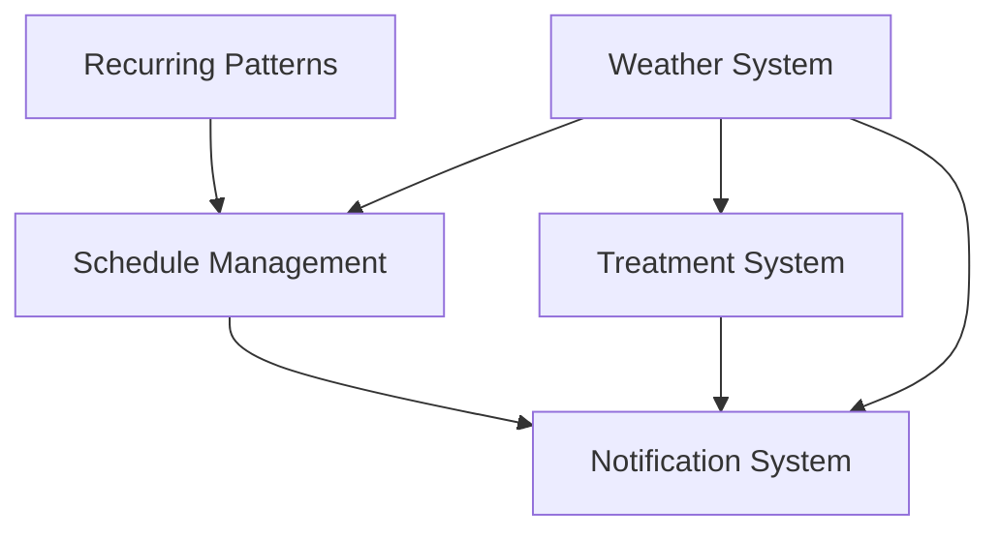

# Integration Plan: Schedule, Weather, and Treatment Systems

## Current Status
- Lawn Profile Management: ✅ Complete
- Weather Integration: 🟨 Partially Complete
- Recurring Schedules: 🟨 Architecture Ready
- Treatment System: 🟨 Basic Structure
- Notification System: 🟦 Planned

## Integration Strategy



### Phase 1: Core Integration (1 week)
1. Weather-Schedule Integration
   - Implement weather checks for scheduled treatments
   - Add weather score calculation
   - Create rescheduling suggestions
   - Update UI to show weather forecasts

2. Schedule-Treatment Connection
   - Link treatments to schedule instances
   - Add treatment status tracking
   - Implement effectiveness scoring
   - Create treatment history view

### Phase 2: Recurring Schedule Implementation (2 weeks)
1. Database Updates
   - Apply schema changes for recurrence
   - Create migration
   - Update existing schedules

2. Core Recurrence Logic
   - Implement pattern generation
   - Add exception handling
   - Create weather-aware scheduling
   - Build conflict resolution

3. UI Components
   - Add recurrence pattern form
   - Create occurrence preview
   - Build exception management interface
   - Implement bulk operations

### Phase 3: Notification System (1 week)
1. Core Notifications
   - Schedule reminders
   - Treatment due dates
   - Weather alerts
   - Status updates

2. Delivery System
   - Email notifications
   - Push notifications
   - In-app alerts
   - Notification preferences

### Phase 4: Smart Features (2 weeks)
1. Weather Optimization
   - Historical pattern analysis
   - Predictive scheduling
   - Treatment effectiveness correlation
   - Automated rescheduling

2. Treatment Intelligence
   - Success rate tracking
   - Weather impact analysis
   - Recommendation engine
   - Optimization suggestions

## Technical Considerations

### Data Flow
```mermaid
sequenceDiagram
    participant W as Weather Service
    participant S as Schedule Manager
    participant T as Treatment Handler
    participant N as Notification System
    
    W->>S: Weather Forecast
    S->>S: Generate/Update Schedule
    S->>T: Create/Update Treatments
    W->>T: Weather Conditions
    T->>T: Calculate Effectiveness
    S->>N: Schedule Updates
    T->>N: Treatment Alerts
    W->>N: Weather Alerts
</sequence>
```

### Integration Points
1. Weather Service
   - Forecast integration
   - Condition monitoring
   - Alert generation
   - Historical analysis

2. Schedule Manager
   - Pattern processing
   - Weather checks
   - Conflict resolution
   - Exception handling

3. Treatment Handler
   - Status tracking
   - Effectiveness scoring
   - History management
   - Recommendation engine

4. Notification System
   - Event monitoring
   - Alert aggregation
   - Delivery management
   - Preference handling

## Implementation Priorities

### Week 1
- [ ] Weather-Schedule Integration
- [ ] Basic Treatment Tracking
- [ ] Core Notification Structure

### Week 2-3
- [ ] Recurring Schedule Implementation
- [ ] Exception Handling
- [ ] UI Components

### Week 4
- [ ] Notification System
- [ ] Alert Management
- [ ] Delivery System

### Week 5-6
- [ ] Weather Optimization
- [ ] Treatment Intelligence
- [ ] System Refinements

## Success Metrics
1. Schedule Reliability
   - Weather-based adjustment accuracy
   - Treatment timing optimization
   - Exception handling effectiveness

2. Treatment Effectiveness
   - Weather correlation accuracy
   - Success rate tracking
   - Recommendation accuracy

3. User Experience
   - Notification relevance
   - UI responsiveness
   - Feature adoption rate

## Risk Management
1. Technical Risks
   - Weather API reliability
   - Performance impact of recurring calculations
   - Data consistency across systems

2. User Risks
   - Complex UI for recurrence
   - Notification overload
   - Weather prediction accuracy

3. Mitigation Strategies
   - Comprehensive testing
   - Gradual feature rollout
   - User feedback integration
   - Performance monitoring

## Next Actions
1. Begin weather-schedule integration
2. Prepare database migration
3. Start notification system setup
4. Create integration test plan