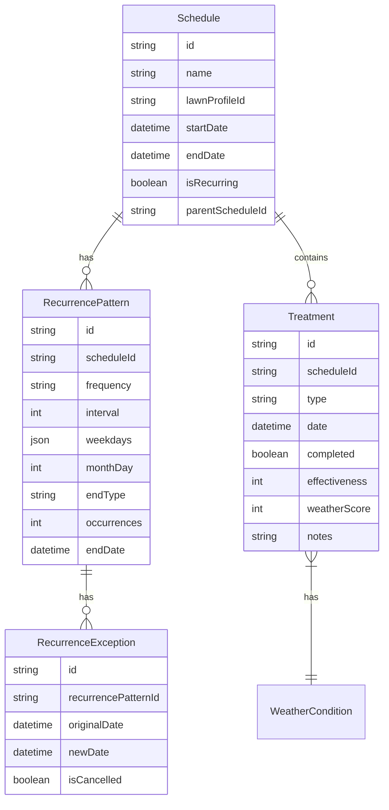
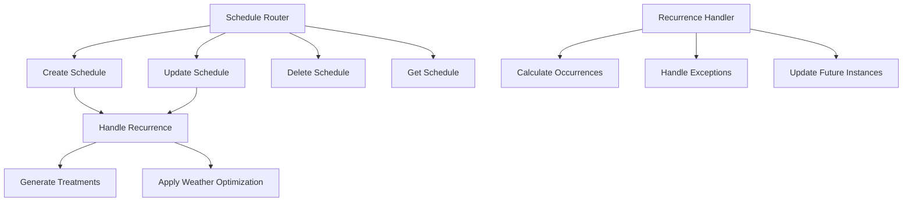
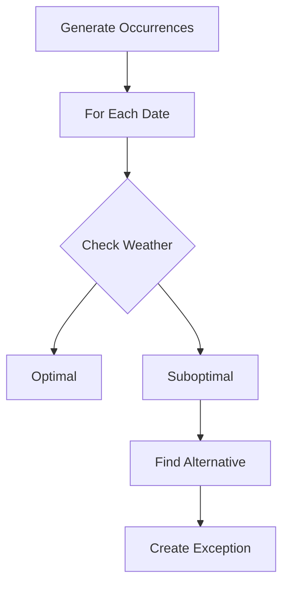

# Recurring Schedules Architecture

## Overview
Implementation plan for adding recurring schedule functionality to the lawn care management system. This feature will allow users to create repeating treatment schedules with smart weather integration and exception handling.

## Data Model



## Database Schema Updates

### New Models

```prisma
model RecurrencePattern {
  id            String    @id @default(cuid())
  scheduleId    String    @unique
  frequency     String    // daily, weekly, monthly
  interval      Int       // every X days/weeks/months
  weekdays      Json?     // [1,3,5] for Mon,Wed,Fri
  monthDay      Int?      // day of month for monthly
  endType       String    // never, after_occurrences, on_date
  occurrences   Int?      // if endType is after_occurrences
  endDate       DateTime? // if endType is on_date
  createdAt     DateTime  @default(now())
  updatedAt     DateTime  @updatedAt

  schedule      Schedule  @relation(fields: [scheduleId], references: [id])
  exceptions    RecurrenceException[]
}

model RecurrenceException {
  id                  String    @id @default(cuid())
  recurrencePatternId String
  originalDate        DateTime
  newDate            DateTime?
  isCancelled        Boolean   @default(false)
  createdAt          DateTime  @default(now())
  updatedAt          DateTime  @updatedAt

  recurrencePattern   RecurrencePattern @relation(fields: [recurrencePatternId], references: [id])
}
```

## API Structure



### New TRPC Procedures

1. Schedule Router Extensions:
   - createRecurringSchedule
   - updateRecurringSchedule
   - updateFutureOccurrences
   - skipOccurrence
   - rescheduleOccurrence

### Recurrence Pattern Interface

```typescript
interface RecurrenceOptions {
  frequency: 'daily' | 'weekly' | 'monthly';
  interval: number;
  weekdays?: number[];
  monthDay?: number;
  endType: 'never' | 'after_occurrences' | 'on_date';
  occurrences?: number;
  endDate?: Date;
}
```

## Weather Integration



### Weather-based Features
1. Automatic monitoring of future occurrences
2. Smart rescheduling suggestions
3. Exception creation for poor weather conditions
4. Weather score tracking for pattern optimization

## UI Components

### Recurrence Form Section
1. Frequency selection (daily, weekly, monthly)
2. Interval input
3. Day selection for weekly recurrence
4. End condition selection
5. Next occurrences preview

### Calendar Enhancements
1. Recurring schedule indicators
2. Exception handling interface
3. Bulk edit capabilities
4. Weather optimization indicators

## Technical Considerations

### Performance Optimizations
1. Lazy loading of future occurrences
2. Batch processing for weather checks
3. Caching of recurring patterns
4. Efficient date calculations

### Edge Cases
1. Timezone handling
2. DST transitions
3. Holiday adjustments
4. Weather-based exceptions
5. Conflict resolution

### Data Integrity
1. Cascading updates/deletes
2. Exception management
3. Weather data consistency
4. Schedule conflict prevention

## Migration Strategy

### Phase 1: Basic Recurrence
1. Database schema updates
2. Core recurrence logic
3. Basic UI implementation

### Phase 2: Weather Integration
1. Weather check integration
2. Optimization algorithms
3. Alert system updates

### Phase 3: Exception Handling
1. Exception management
2. UI for managing exceptions
3. Bulk operations

### Phase 4: Advanced Features
1. Pattern optimization
2. Weather prediction integration
3. Smart rescheduling
4. Analytics and reporting

## Implementation Timeline
- Phase 1: 2 weeks
- Phase 2: 2 weeks
- Phase 3: 1 week
- Phase 4: 2 weeks

Total estimated time: 7 weeks

## Next Steps
1. Create database migration
2. Implement core recurrence logic
3. Update schedule router
4. Develop UI components
5. Integrate weather optimization
6. Add exception handling
7. Test and refine

## Technical Debt Considerations
1. Performance monitoring needed for recurring calculations
2. Weather data caching strategy required
3. Consider future scalability for pattern storage
4. Plan for handling timezone complexities