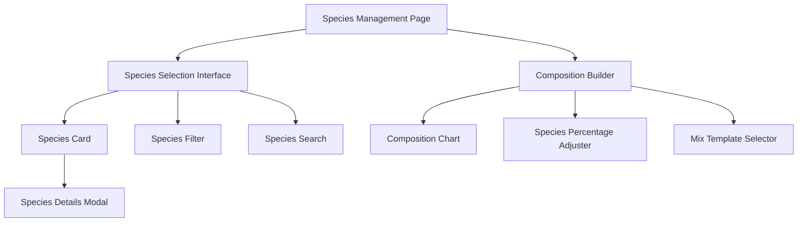

# Grass Species Management UI Implementation Plan

## 1. Component Structure



## 2. Component Details

### A. Species Selection Interface

1. **Species Card Component**
   ```typescript
   interface SpeciesCardProps {
     species: GrassSpecies;
     onSelect: (species: GrassSpecies) => void;
     selected: boolean;
   }
   ```
   - Visual representation of grass species
   - Quick view of key characteristics
   - Selection indicator
   - Hover state with additional details

2. **Species Filter Component**
   ```typescript
   interface SpeciesFilterProps {
     onFilterChange: (filters: SpeciesFilters) => void;
     activeFilters: SpeciesFilters;
   }
   ```
   - Type filter (cool-season/warm-season)
   - Characteristic filters
   - Regional suitability filter

3. **Species Search Component**
   ```typescript
   interface SpeciesSearchProps {
     onSearch: (term: string) => void;
     searchTerm: string;
   }
   ```
   - Search by name or scientific name
   - Autocomplete suggestions
   - Recent selections

### B. Composition Builder

1. **Composition Chart Component**
   ```typescript
   interface CompositionChartProps {
     composition: LawnGrassComposition[];
     onCompositionChange: (composition: LawnGrassComposition[]) => void;
   }
   ```
   - Visual pie/donut chart
   - Interactive percentage adjustment
   - Color coding by species type
   - Validation indicators

2. **Species Percentage Adjuster**
   ```typescript
   interface PercentageAdjusterProps {
     species: GrassSpecies;
     percentage: number;
     onPercentageChange: (percentage: number) => void;
     maxAllowed: number;
   }
   ```
   - Slider or number input
   - Real-time validation
   - Auto-balancing with other species

3. **Mix Template Selector**
   ```typescript
   interface MixTemplateProps {
     templates: GrassMixTemplate[];
     onTemplateSelect: (template: GrassMixTemplate) => void;
     currentComposition: LawnGrassComposition[];
   }
   ```
   - Common mix presets
   - Regional recommendations
   - Custom mix saving

## 3. State Management

```typescript
interface SpeciesManagementState {
  selectedSpecies: GrassSpecies[];
  composition: LawnGrassComposition[];
  filters: SpeciesFilters;
  searchTerm: string;
  activeTemplate: GrassMixTemplate | null;
}
```

## 4. Implementation Phases

### Phase 1: Core Components (2-3 days)
1. Basic species card and grid layout
2. Species search and filtering
3. Simple composition percentage inputs

### Phase 2: Visual Enhancements (2-3 days)
1. Interactive composition chart
2. Drag-and-drop species selection
3. Responsive design and animations

### Phase 3: Advanced Features (2-3 days)
1. Mix templates and recommendations
2. Validation and warning system
3. Species compatibility checking

## 5. Integration Points

1. **TRPC Integration**
   - Species data fetching
   - Composition persistence
   - Mix recommendations

2. **Treatment System Integration**
   - Species-specific treatment recommendations
   - Composition-based care instructions
   - Evidence presentation

3. **User Experience**
   - Progressive disclosure of information
   - Contextual help and tooltips
   - Validation feedback

## 6. Success Criteria

1. **Usability**
   - Users can easily select species
   - Composition adjustments are intuitive
   - Visual feedback is clear and helpful

2. **Performance**
   - Smooth interactions with large species lists
   - Quick composition updates
   - Efficient data loading

3. **Reliability**
   - Accurate composition calculations
   - Consistent state management
   - Proper error handling