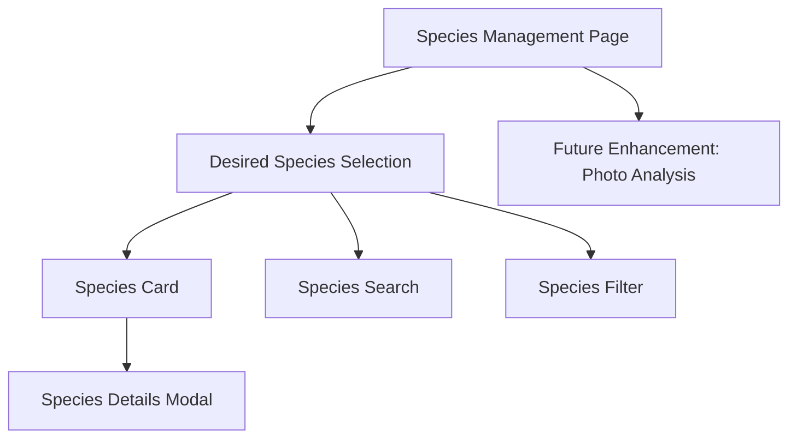

# Simplified Grass Species Management UI Implementation Plan

## 1. Component Structure



## 2. Component Details

### A. Desired Species Selection

1. **Species Card Component**
   ```typescript
   interface SpeciesCardProps {
     species: GrassSpecies;
     onSelect: (species: GrassSpecies) => void;
     selected: boolean;
   }
   ```
   - Clear visual representation
   - Key characteristics display
   - Simple selection mechanism
   - Educational tooltips for species information

2. **Species Filter Component**
   ```typescript
   interface SpeciesFilterProps {
     onFilterChange: (filters: SpeciesFilters) => void;
     activeFilters: SpeciesFilters;
   }
   ```
   - Climate-based filtering (cool-season/warm-season)
   - Regional suitability filter
   - Maintenance level filter (low/medium/high)

3. **Species Search Component**
   ```typescript
   interface SpeciesSearchProps {
     onSearch: (term: string) => void;
     searchTerm: string;
   }
   ```
   - Simple search by common name
   - Autocomplete with visual hints
   - Common species suggestions

### B. Educational Elements

1. **Species Information Display**
   - Clear, non-technical descriptions
   - Visual growth characteristics
   - Maintenance requirements
   - Regional suitability indicators

2. **Help System**
   - Context-sensitive help
   - Species selection guidance
   - Regional recommendations
   - Common species identification tips

## 3. State Management

```typescript
interface SpeciesManagementState {
  selectedSpecies: GrassSpecies;
  filters: SpeciesFilters;
  searchTerm: string;
  region: Region;
}
```

## 4. Implementation Phases

### Phase 1: Core Selection Interface (2-3 days)
1. Basic species cards with clear visuals
2. Simple search and filtering
3. Educational tooltips and help system

### Phase 2: User Guidance (2-3 days)
1. Regional recommendations
2. Species information modals
3. Selection assistance

### Phase 3: Future Enhancement Planning (1-2 days)
1. Photo analysis system design
2. API integration points
3. ML model requirements

## 5. Integration Points

1. **TRPC Integration**
   - Species data fetching
   - Regional recommendations
   - Selection persistence

2. **User Experience**
   - Simple, guided selection process
   - Educational content integration
   - Clear feedback system

## 6. Success Criteria

1. **Usability**
   - Users can easily select desired species
   - Information is presented clearly
   - Selection process is intuitive

2. **Education**
   - Users understand species characteristics
   - Clear maintenance requirements
   - Regional suitability is obvious

3. **Future Readiness**
   - System designed for photo analysis integration
   - API endpoints prepared for ML integration
   - Data structure supports automated identification

## 7. Future Enhancement: Photo Analysis

### Phase 1: Infrastructure
1. Photo upload system
2. Image processing pipeline
3. Storage and retrieval system

### Phase 2: ML Integration
1. Species identification model
2. Ratio analysis
3. Confidence scoring

### Phase 3: User Interface
1. Photo upload interface
2. Results display
3. Manual correction tools

Note: The photo analysis feature will be implemented in a future update. The current focus is on creating a simple, educational interface for users to select their desired grass species.