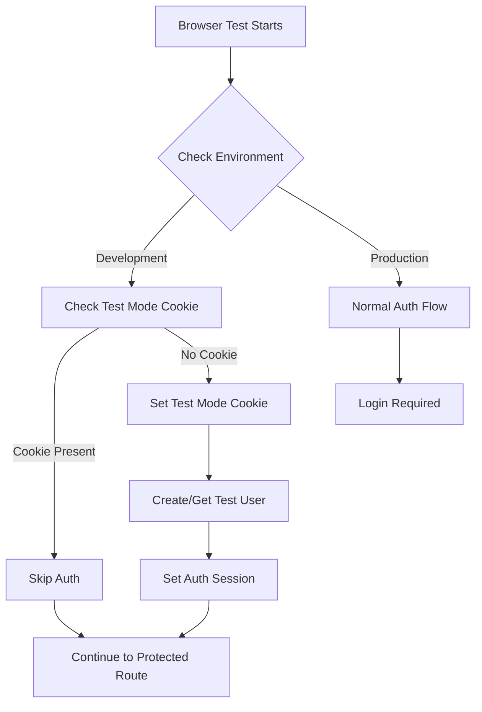

# Authentication Bypass System for Browser Testing

## Overview
Implementation plan for automating authentication bypass during browser testing to improve development efficiency.

## Current System Analysis
1. Existing Components:
   - Development bypass provider in auth-options.ts
   - Basic development environment detection in middleware
   - Test user creation functionality

2. Identified Gaps:
   - No automatic login for browser tests
   - Session persistence issues
   - Manual authentication still required

## Proposed Solution

## Implementation Components

### 1. Enhanced Development Detection
- Add `NEXT_PUBLIC_TEST_MODE` environment variable
- Purpose: Explicit test mode enablement
- Separate from general development environment

### 2. Automated Test User Setup
- Enhance dev-bypass provider
- Automatic session creation
- Persistent test user credentials
- Consistent test user state

### 3. Session Management
- Test mode cookie implementation
- Automatic auth session setting
- Session renewal handling
- Cross-browser session persistence

### 4. Middleware Updates
- Test mode detection
- Bypass logic implementation
- Production security maintenance
- Route protection enhancement

## Required Code Changes

### auth-options.ts
- Enhance dev-bypass provider
- Add automatic session creation
- Implement test user management

### middleware.ts
- Add test mode detection
- Implement bypass logic
- Enhance security checks

### New Utilities
- Test mode detection functions
- Session management utilities
- Test user state management

## Security Considerations
1. Test mode strictly limited to development
2. Production safeguards
3. Secure credential handling
4. Environment separation

## Implementation Steps
1. Environment variable setup
2. Auth provider enhancement
3. Middleware updates
4. Session management implementation
5. Testing and validation

## Success Criteria
- Automatic authentication in test mode
- Persistent sessions across tests
- No production impact
- Maintained security model