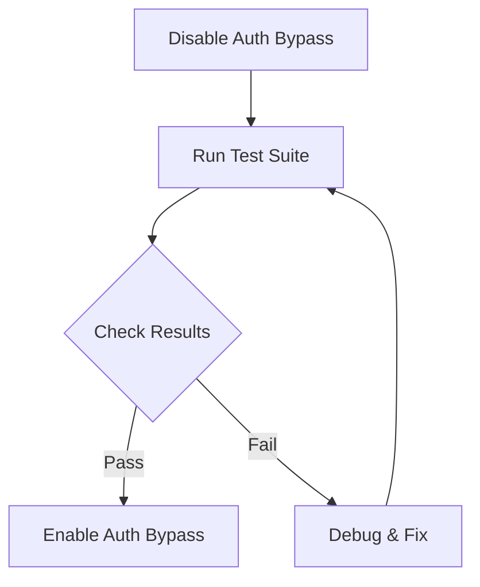

# End-to-End Authentication Testing Plan

## Overview
This document outlines the comprehensive testing strategy for the authentication system, covering both development and production environments.

## Test Environment Setup

### Development Mode
```bash
# Required environment variables
NODE_ENV=development
NEXTAUTH_URL=http://localhost:3000
GOOGLE_CLIENT_ID=your_dev_client_id
GOOGLE_CLIENT_SECRET=your_dev_client_secret
```

### Production Mode
```bash
# Required environment variables
NODE_ENV=production
NEXTAUTH_URL=https://your-production-url.com
GOOGLE_CLIENT_ID=your_prod_client_id
GOOGLE_CLIENT_SECRET=your_prod_client_secret
```

## 1. Email/Password Authentication Flow

### Registration Testing
1. Form Validation
   - Empty fields validation
   - Email format validation
   - Password requirements validation
   - Duplicate email handling
   - Success state verification

2. User Creation
   - Database entry verification
   - Password hashing confirmation
   - Initial user settings creation
   - Welcome email trigger

### Login Testing
1. Form Validation
   - Empty fields validation
   - Invalid email format handling
   - Non-existent user handling
   - Incorrect password handling

2. Session Management
   - JWT token generation
   - Session persistence
   - Session expiration
   - Multiple device handling

3. Error States
   - Network error handling
   - Server error handling
   - Rate limiting behavior
   - Security headers verification

## 2. Google OAuth Flow

1. OAuth Integration
   - OAuth consent screen
   - Scope permissions
   - User info retrieval
   - Account linking (if existing email)

2. Error Handling
   - Cancelled authentication
   - Invalid state parameter
   - Missing permissions
   - Network failures

## 3. Password Reset Flow

1. Request Process
   - Email validation
   - Token generation
   - Email delivery
   - Rate limiting

2. Reset Process
   - Token validation
   - Expiration handling
   - Password update
   - Session management

## 4. Protected Routes

1. Middleware Testing
   - Authentication verification
   - Role-based access
   - Redirect behavior
   - Header handling

2. Client-side Protection
   - Route protection
   - Component visibility
   - Data fetching behavior
   - Loading states

## 5. TRPC Integration

1. Authentication Context
   - Session propagation
   - Token validation
   - Error handling
   - Type safety

2. Protected Procedures
   - Authorization checks
   - Error responses
   - Session handling
   - Rate limiting

## 6. Development Bypass System

1. Auto-login Functionality
   - Route interception
   - Session creation
   - User context
   - Persistence

2. Test Account Usage
   - Credentials: test@example.com / TestPassword123!
   - Permission scope
   - Data isolation
   - Session duration

## Test Execution Steps

### 1. Development Testing


### 2. Production Testing


## Success Criteria

1. Registration Flow
   - ✓ User successfully created
   - ✓ Welcome email received
   - ✓ Automatic login after registration
   - ✓ Redirect to dashboard

2. Login Flow
   - ✓ Successful authentication
   - ✓ Session persistence
   - ✓ Proper error handling
   - ✓ Security headers present

3. Password Reset
   - ✓ Reset email delivered
   - ✓ Token validation works
   - ✓ Password successfully updated
   - ✓ User notified of change

4. Protected Routes
   - ✓ Unauthorized access prevented
   - ✓ Proper redirects
   - ✓ Role-based access working
   - ✓ Session handling correct

5. TRPC Integration
   - ✓ Protected procedures secured
   - ✓ Error handling working
   - ✓ Session propagation correct
   - ✓ Type safety maintained

## Test Data Requirements

1. Test Users
   ```typescript
   const testUsers = {
     basic: {
       email: 'test@example.com',
       password: 'TestPassword123!'
     },
     google: {
       email: 'test.google@example.com'
     }
   }
   ```

2. Invalid Test Cases
   ```typescript
   const invalidCases = {
     email: ['invalid', 'test@', '@example.com'],
     password: ['short', 'nodigits', 'NO_LOWER'],
     token: ['expired', 'invalid', 'malformed']
   }
   ```

## Monitoring & Logging

1. Key Metrics
   - Authentication success rate
   - Password reset completion rate
   - Session duration statistics
   - Error frequency by type

2. Log Requirements
   - Authentication attempts
   - Password reset requests
   - Session operations
   - Security events

## Implementation Notes

1. Test Environment
   - Use separate test database
   - Mock email service
   - Simulate network conditions
   - Track test coverage

2. Security Considerations
   - Rate limiting
   - Brute force protection
   - Session fixation prevention
   - CSRF protection

3. Performance Requirements
   - Auth response < 500ms
   - Session validation < 100ms
   - Password hashing < 1s
   - Token generation < 100ms