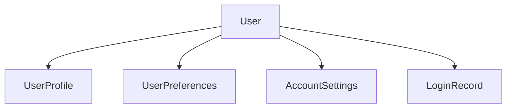

# User Management Implementation - March 8, 2025

## Completed Tasks

1. Schema Updates
   - Added UserProfile model
   - Added UserPreferences model
   - Added AccountSettings model
   - Added LoginRecord model
   - Added proper relations and indexes

2. Seed Data Implementation
   - Created test user accounts
   - Added complete user profiles
   - Added user preferences
   - Added account settings
   - Added login history records

3. Test Data Created
   ```
   Regular User:
   - Email: test@example.com
   - Name: Test User
   - Role: Regular lawn care enthusiast
   - Location: Austin, TX

   Professional User:
   - Email: pro@example.com
   - Name: Pro User
   - Role: Professional landscaper
   - Location: Dallas, TX
   ```

## Technical Details

### Database Structure


### Implementation Approach
1. Used raw SQL for reliable data seeding
2. Implemented proper transaction handling
3. Added comprehensive test data
4. Maintained existing grass species data

## Next Steps

1. User Management Features
   - [ ] Implement profile editing
   - [ ] Add preferences management
   - [ ] Create account settings UI
   - [ ] Add login history viewing

2. UI Components
   - [ ] Profile editor
   - [ ] Preferences panel
   - [ ] Settings dashboard
   - [ ] Login history viewer

3. API Routes
   - [ ] Profile management endpoints
   - [ ] Preferences update endpoints
   - [ ] Settings management endpoints
   - [ ] Login history endpoints

4. Security Features
   - [ ] Add profile privacy controls
   - [ ] Implement session management
   - [ ] Add account security settings
   - [ ] Implement login monitoring

## Related Files

- prisma/schema.prisma
- prisma/seed.ts
- prisma/seed-data/user-management.ts

## Notes

The user management system is now ready for feature implementation. The database structure and test data provide a solid foundation for building the user interface and API endpoints.