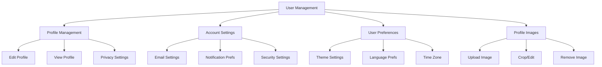

# User Management Implementation Specification

## Overview

This document details the implementation plan for completing the user management system, which is the first priority in our deployment task breakdown.

## Features



## Technical Requirements

### 1. Profile Management

#### Data Model Extensions
```typescript
interface UserProfile {
  id: string;
  userId: string;
  displayName: string;
  bio?: string;
  location?: string;
  website?: string;
  privacySettings: {
    profileVisibility: 'public' | 'private' | 'friends';
    showEmail: boolean;
    showLocation: boolean;
  };
  createdAt: Date;
  updatedAt: Date;
}
```

#### API Endpoints
```typescript
// Profile Routes
POST   /api/profile/create
GET    /api/profile/:userId
PUT    /api/profile/update
DELETE /api/profile/delete

// Privacy Routes
PUT    /api/profile/privacy
GET    /api/profile/privacy/settings
```

### 2. Account Settings

#### Data Model Extensions
```typescript
interface AccountSettings {
  userId: string;
  email: {
    primary: string;
    notifications: string;
    verified: boolean;
  };
  notifications: {
    email: boolean;
    push: boolean;
    sms: boolean;
  };
  security: {
    twoFactorEnabled: boolean;
    lastPasswordChange: Date;
    loginHistory: LoginRecord[];
  };
}
```

#### API Endpoints
```typescript
// Email Settings
PUT    /api/settings/email
POST   /api/settings/email/verify

// Notification Settings
PUT    /api/settings/notifications
GET    /api/settings/notifications

// Security Settings
PUT    /api/settings/security
GET    /api/settings/security/status
```

### 3. User Preferences

#### Data Model Extensions
```typescript
interface UserPreferences {
  userId: string;
  theme: 'light' | 'dark' | 'system';
  language: string;
  timezone: string;
  dateFormat: string;
  timeFormat: '12h' | '24h';
  measurements: 'imperial' | 'metric';
}
```

#### API Endpoints
```typescript
// Preference Routes
GET    /api/preferences
PUT    /api/preferences/update
POST   /api/preferences/reset
```

### 4. Profile Images

#### Data Model Extensions
```typescript
interface ProfileImage {
  userId: string;
  url: string;
  thumbnailUrl: string;
  originalFilename: string;
  mimeType: string;
  size: number;
  dimensions: {
    width: number;
    height: number;
  };
  uploadedAt: Date;
}
```

#### API Endpoints
```typescript
// Image Routes
POST   /api/profile/image/upload
PUT    /api/profile/image/crop
DELETE /api/profile/image
GET    /api/profile/image/:size
```

## Implementation Steps

### 1. Database Schema Updates
1. Add new tables and relations
2. Create migrations
3. Update Prisma schema
4. Add indexes for performance

### 2. API Implementation
1. Create new API routes
2. Add input validation
3. Implement error handling
4. Add rate limiting

### 3. Frontend Components
1. Profile editor
2. Settings panels
3. Image upload/crop
4. Preference controls

### 4. Integration
1. Connect to auth system
2. Add to navigation
3. Update protected routes
4. Add to user dashboard

## Success Criteria

### Functionality
- [ ] Complete profile CRUD operations
- [ ] Working settings management
- [ ] Functional preference system
- [ ] Image upload and management

### Performance
- [ ] < 100ms API response time
- [ ] < 1s image upload time
- [ ] Optimized database queries
- [ ] Proper caching implementation

### Security
- [ ] Input validation
- [ ] XSS prevention
- [ ] CSRF protection
- [ ] Rate limiting

### UX
- [ ] Intuitive navigation
- [ ] Clear error messages
- [ ] Loading states
- [ ] Success feedback

## Next Steps

1. Switch to Code mode to begin implementation
2. Start with database schema updates
3. Implement core API endpoints
4. Create frontend components

## Dependencies

- Auth system (already implemented)
- File storage service (for images)
- Email service (for notifications)
- Database migrations system