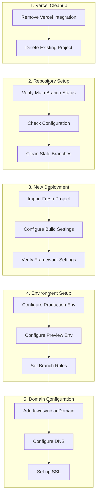

# Vercel Implementation Plan

## Implementation Flow



## Detailed Steps

### 1. Vercel Cleanup
- Remove existing Vercel integration from GitHub
- Delete the project from Vercel dashboard
- Ensure all webhooks are removed

### 2. Repository Setup
- Verify main branch is default and contains latest code
- Confirm vercel.json configuration is correct:
```json
{
  "version": 2,
  "buildCommand": "npx prisma generate && npm run build",
  "devCommand": "npm run dev",
  "installCommand": "npm install",
  "framework": "nextjs",
  "git": {
    "deploymentEnabled": {
      "main": true,
      "staging": true
    }
  }
}
```

### 3. New Deployment Setup
- Import project fresh in Vercel
- Configure build settings:
  - Framework: Next.js
  - Build Command: `npx prisma generate && npm run build`
  - Output Directory: .next
  - Install Command: `npm install`

### 4. Environment Configuration
Set up environment variables:
- Production Environment:
  - DATABASE_URL
  - NEXTAUTH_URL
  - NEXTAUTH_SECRET
  - NODE_ENV=production
  - Database configuration variables:
    - DATABASE_RELATION_MODE=prisma
    - DATABASE_SSL_ENABLED=true
    - DATABASE_SSL_REJECT_UNAUTHORIZED=true
    - DATABASE_POOL_MIN=2
    - DATABASE_POOL_MAX=20
    - DATABASE_POOL_TIMEOUT=30000
    - DATABASE_POOL_IDLE_TIMEOUT=60000
- Preview Environment:
  - Separate DATABASE_URL
  - Dynamic NEXTAUTH_URL
  - Development-specific settings

### 5. Domain Setup
- Add lawnsync.ai domain
- Configure DNS settings
- Set up SSL certificates
- Verify domain propagation

## Success Criteria
1. Successful build and deployment from main branch
2. All environment variables properly configured
3. Domain properly configured with SSL
4. Preview deployments working for PRs
5. Build command executing correctly

## Implementation Notes
- Reference existing configuration from previous setup
- Ensure all database connection settings are properly transferred
- Verify branch deployment rules match repository structure
- Document any deviations from plan during implementation

## Related Documents
- DEPLOYMENT_RETRY_PLAN.md
- SESSION_NOTES/2025-03-08_vercel_deployment_setup.md
- DEPLOYMENT_ENVIRONMENT_PLAN.md
- DOMAIN_SETUP_PLAN.md