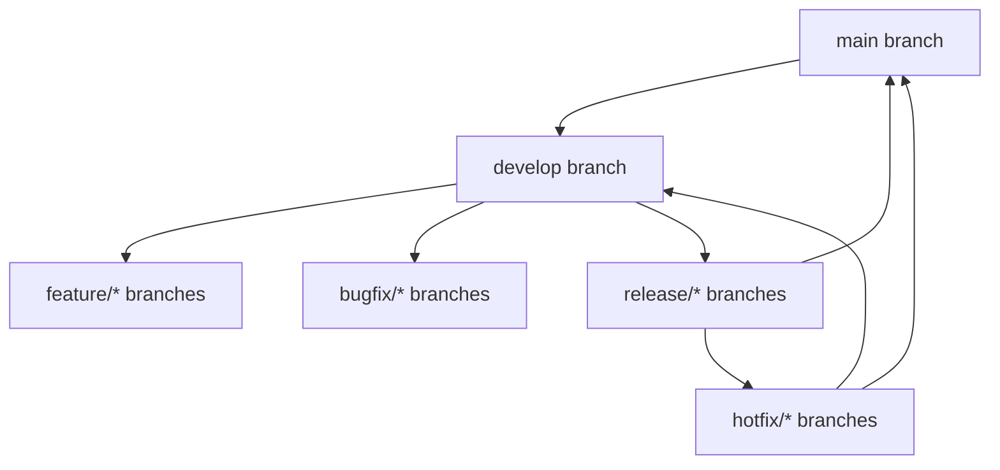
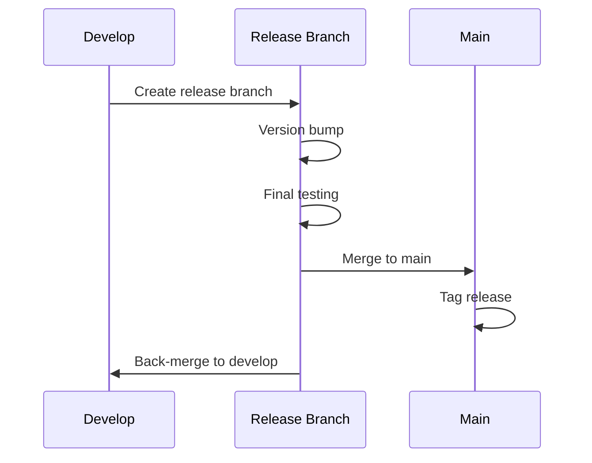

# Version Control Guidelines

## Overview
This document outlines the version control strategy for the Lawn Genius project, including branching strategy, commit guidelines, pull request workflow, release management, and automation practices.

## Branch Structure



### Branch Types

#### main
- Production-ready code
- Protected branch
- Requires PR approvals
- Only accepts merges from release/* and hotfix/* branches
- Tagged with version numbers

#### develop
- Main development branch
- Protected branch
- Integration point for features
- Source for release branches
- Always contains latest development changes

#### feature/*
- Format: feature/[ticket-number]-brief-description
- Branched from: develop
- Merges to: develop
- Example: feature/LG-123-weather-alerts
- Used for new features and enhancements

#### bugfix/*
- Format: bugfix/[ticket-number]-brief-description
- Branched from: develop
- Merges to: develop
- Example: bugfix/LG-456-auth-session-fix
- Used for non-critical bug fixes

#### release/*
- Format: release/v[major].[minor].[patch]
- Branched from: develop
- Merges to: main and develop
- Example: release/v1.2.0
- Used for release preparation and final testing

#### hotfix/*
- Format: hotfix/[ticket-number]-brief-description
- Branched from: main
- Merges to: main and develop
- Example: hotfix/LG-789-critical-security-fix
- Used for urgent production fixes

## Commit Guidelines

### Conventional Commits Format
```
type(scope): description [ticket-number]

[optional body]

[optional footer]
```

### Commit Types
- **feat**: New features
- **fix**: Bug fixes
- **docs**: Documentation changes
- **style**: Code style changes (formatting, missing semi-colons, etc.)
- **refactor**: Code refactoring
- **test**: Adding or updating tests
- **chore**: Build process or auxiliary tool changes

### Examples
```
feat(weather): add precipitation alerts [LG-123]

Add real-time precipitation monitoring and alert system
- Implement OpenWeather API integration
- Add alert thresholds configuration
- Create notification system integration

Breaking Change: Updates weather alert schema
```

```
fix(auth): resolve session timeout issue [LG-456]

- Update session duration calculation
- Add refresh token rotation
- Improve error handling
```

## Pull Request Process

### 1. Creation
- Clear title following commit convention
- Description template:
  ```markdown
  ## Changes
  - Detailed list of changes
  - Impact on existing functionality
  - New dependencies added

  ## Testing
  - [ ] Steps to test changes
  - [ ] Test scenarios covered
  - [ ] Edge cases considered

  ## Screenshots
  [If UI changes]

  ## Checklist
  - [ ] Tests added/updated
  - [ ] Documentation updated
  - [ ] No new console warnings
  - [ ] Tested in development
  ```

### 2. Review Requirements
- Minimum 1 reviewer approval
- All CI checks passing
- No merge conflicts
- Up-to-date with target branch
- Code coverage maintained or improved

### 3. Merge Strategy
- Squash and merge for feature/bugfix branches
- Create merge commit for release/hotfix branches
- Delete source branch after merge

## Release Management

### 1. Version Control
- Semantic versioning (MAJOR.MINOR.PATCH)
  - MAJOR: Breaking changes
  - MINOR: New features, backward compatible
  - PATCH: Bug fixes, backward compatible
- Automated changelog generation
- Release tags on main branch

### 2. Release Process



### 3. Release Steps
1. Create release branch
2. Update version numbers
3. Generate changelog
4. Perform final testing
5. Create pull request to main
6. After merge, tag release
7. Back-merge to develop

## Automation & Quality Gates

### 1. Pre-commit Hooks
- Lint staged files
- Run type checking
- Format code
- Validate commit messages
- Check for sensitive data

### 2. CI/CD Pipeline
- Build verification
- Test execution
- Code coverage check (minimum 80%)
- Security scanning
- Dependency audit
- Deployment to staging

### 3. Quality Metrics
- Test coverage
- Code quality scores
- Build performance
- Deployment success rate
- Time to recovery

## Best Practices

### 1. Branch Management
- Keep branches short-lived
- Regular rebasing with parent branch
- Delete merged branches
- Use meaningful branch names

### 2. Commits
- Atomic commits (single responsibility)
- Clear and descriptive messages
- Reference ticket numbers
- No sensitive information

### 3. Code Review
- Review within 24 hours
- Constructive feedback
- Check for security issues
- Verify test coverage
- Consider performance impact

### 4. Documentation
- Update docs with code changes
- Keep README.md current
- Document breaking changes
- Maintain changelog
- Update API documentation

## Tools and Integration

### 1. Git Hooks
- pre-commit: linting, formatting
- pre-push: tests, type checking
- commit-msg: message validation

### 2. GitHub Actions
- Automated testing
- Build verification
- Deployment pipelines
- Security scanning
- Performance monitoring

### 3. Code Quality
- ESLint for code linting
- Prettier for formatting
- TypeScript for type checking
- Jest for testing
- SonarQube for analysis