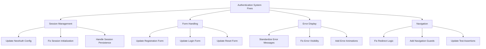

# Authentication System Fix Plan

## Overview

This plan addresses the persistent test failures in the authentication system, focusing on four key areas:
1. Session Management
2. Form Handling
3. Error Display
4. Navigation

## System Architecture



## Detailed Implementation Plan

### 1. Session Management

```typescript
// 1.1 Update NextAuth Configuration
- Remove duplicate authorize function
- Add proper session callbacks
- Add session cleanup on sign-in
- Add proper JWT handling

// 1.2 Fix Session Initialization
- Add session status checks
- Add proper session event handling
- Add session persistence checks

// 1.3 Handle Session Persistence
- Add session storage
- Add session recovery
- Add session validation
```

### 2. Form Handling

```typescript
// 2.1 Update Registration Form
- Add proper form validation
- Add error state management
- Add loading state management
- Add session establishment checks

// 2.2 Update Login Form
- Add immediate error display
- Add validation feedback
- Add session checks
- Add navigation handling

// 2.3 Update Reset Form
- Add proper error messages
- Add validation states
- Add success messages
```

### 3. Error Display

```typescript
// 3.1 Standardize Error Messages
- Create error message constants
- Add error message components
- Add error message animations

// 3.2 Fix Error Visibility
- Add immediate error display
- Add error state management
- Add error clearing

// 3.3 Add Error Animations
- Add fade-in animations
- Add error highlighting
- Add error icons
```

### 4. Navigation

```typescript
// 4.1 Fix Redirect Logic
- Add proper navigation guards
- Add session checks
- Add loading states

// 4.2 Add Navigation Guards
- Add route protection
- Add session validation
- Add redirect handling

// 4.3 Update Test Assertions
- Add proper wait conditions
- Add state checks
- Add error handling
```

## Implementation Order

1. First Phase (Session Foundation)
   - Fix NextAuth configuration
   - Update session handling
   - Add proper JWT management

2. Second Phase (Form Updates)
   - Update form components
   - Add proper validation
   - Add error handling

3. Third Phase (Error System)
   - Add standardized error display
   - Update error messages
   - Add error animations

4. Fourth Phase (Navigation)
   - Fix redirect logic
   - Add navigation guards
   - Update test assertions

## Current Test Failures

1. Registration Issues:
   - Error: "Registration failed: "
   - No error message visible
   - Not redirecting to dashboard

2. Login Issues:
   - Error: "Login failed: "
   - Session not being established
   - Welcome message not visible

3. Error Message Issues:
   - "Invalid email format" not visible
   - "Check your email" not visible
   - "Invalid or expired reset token" not visible

## Next Steps

1. Begin with session management fixes as they form the foundation
2. Move to form handling to ensure proper user interaction
3. Implement error display system for better user feedback
4. Finally, address navigation to ensure proper flow